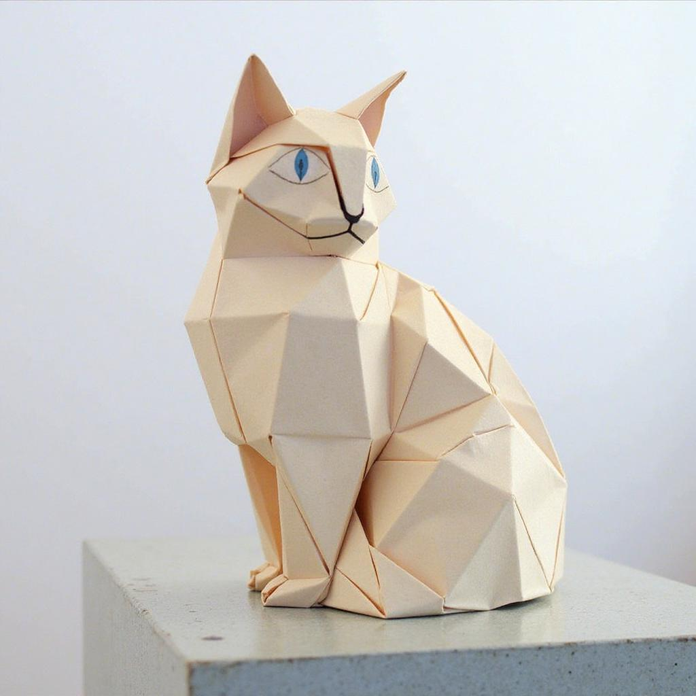
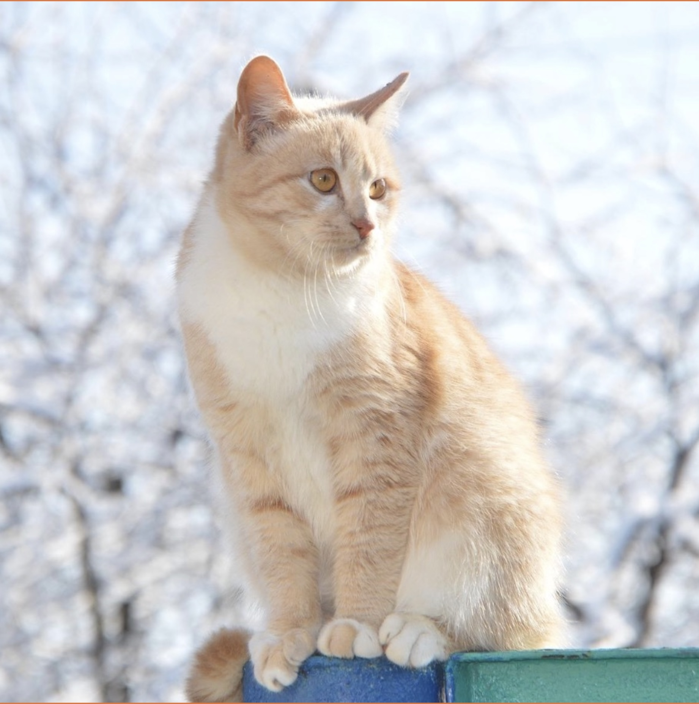
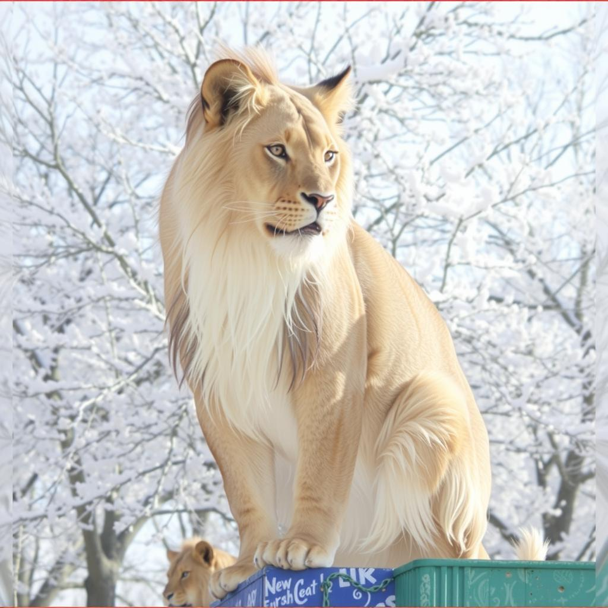
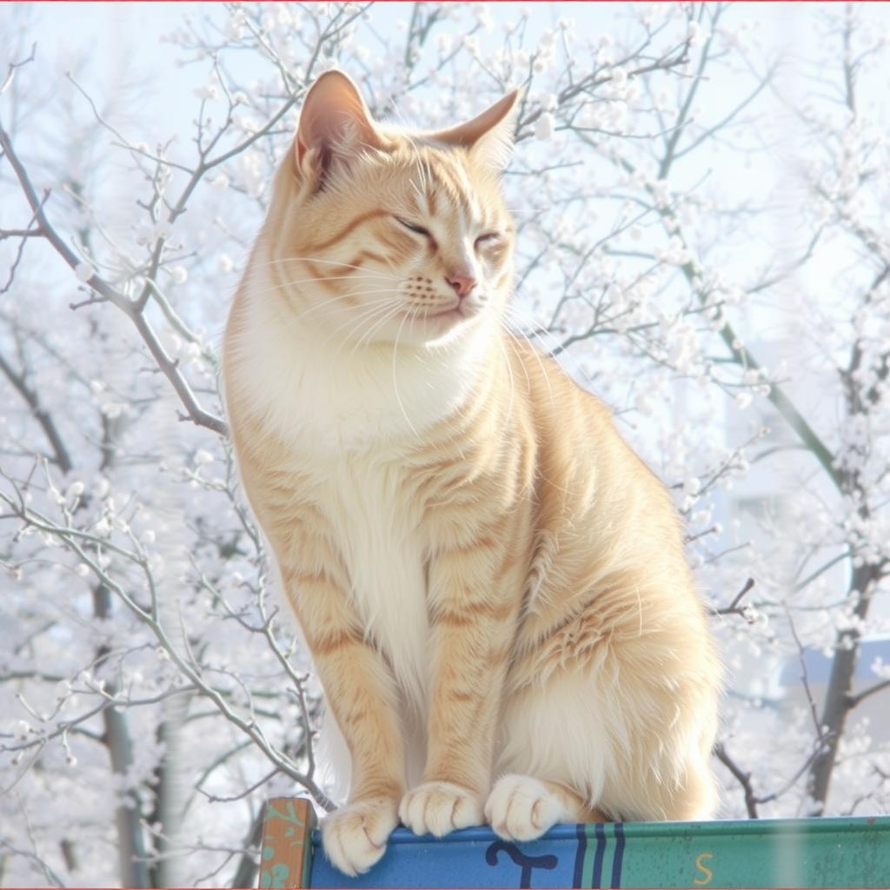
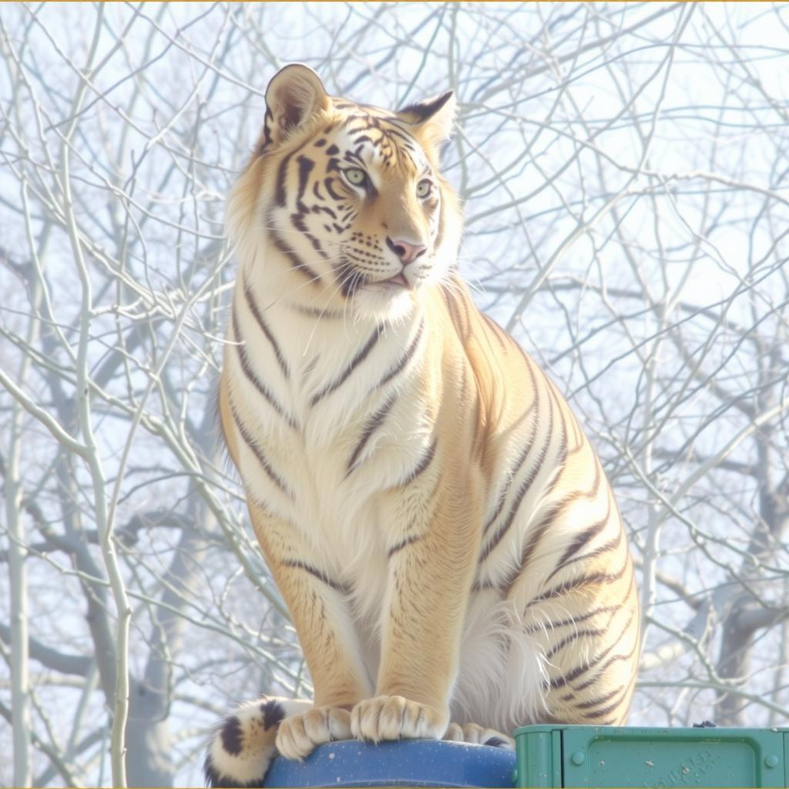
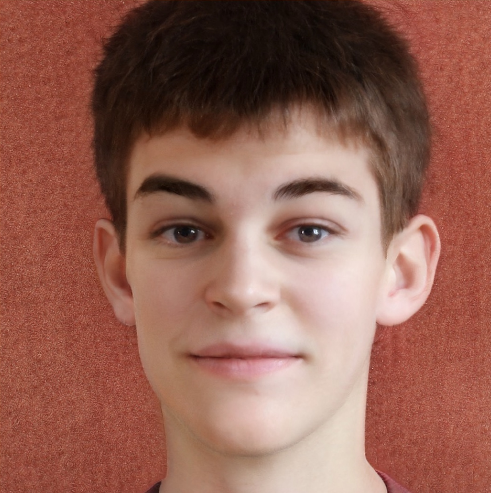
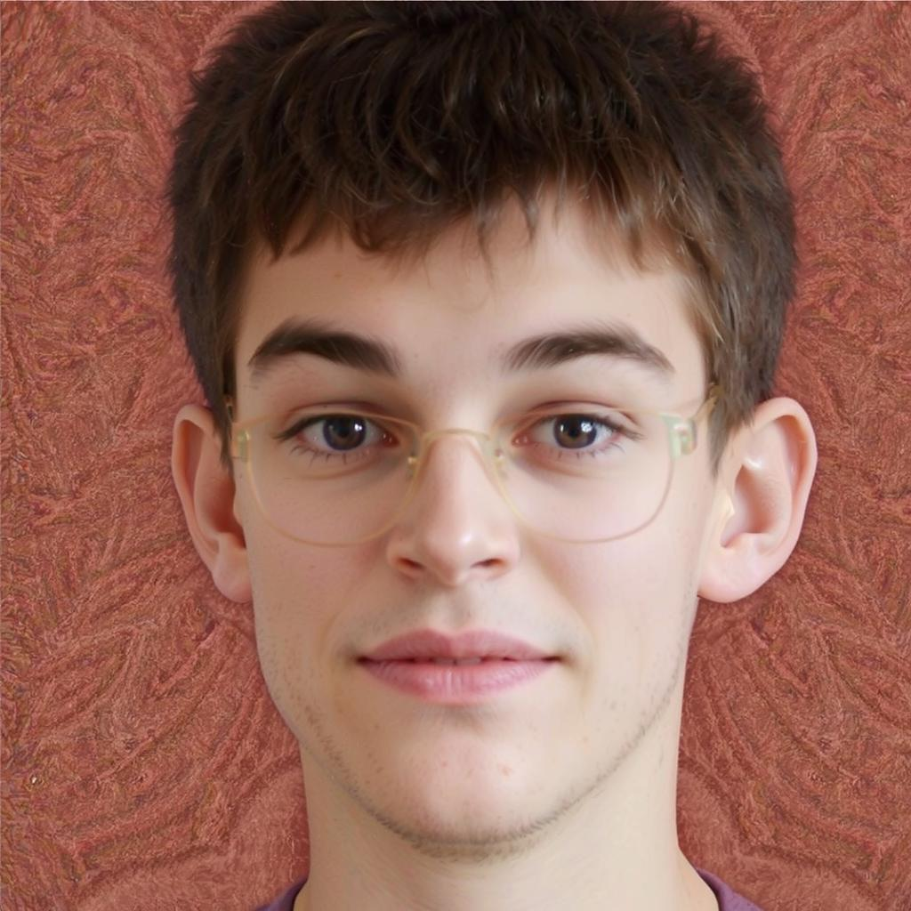

# rf_inversion

This repository is unofficial implementation of RF Inversion, "Semantic Image Inversion and Editing using
Stochastic Rectified Differential Equations".
https://rf-inversion.github.io/ 

``` コマンド例
python main.py --image examples/man.jpg --prompt "A portrait of a man wearing glasses" --output outputs/man_glasses_eta09_s6e20.jpg --eta 0.9 --start_timestep 6 --stop_timestep 20 
```

etaが大きいと元の画像に近くなる

start_timestepとstop_timestepはetaを有効にするtimestepで
`0 <= start_timestep < stop_timestep < num_inference_step`

コントロールが難しい

## Examples

```python main.py --image examples/man.jpg --prompt "Face of a laugh boy in disney 3d cartoon style" --output outputs/man_cartoon_laugh_gamma05_eta09_s0e6_st95_dev.jpg --eta 0.9 --start_timestep 0 --stop_timestep 6 --gamma 0.5 --model black-forest-labs/FLUX.1-dev```


```python main.py --image examples/man.jpg --prompt "An angry face of an angry boy in disney 3d cartoon style, angry" --output outputs/man_cartoon_angry_gamma05_eta09_s0e6_dev2.jpg --eta 0.9 --start_timestep 0 --stop_timestep 6 --gamma 0.5 --model black-forest-labs/FLUX.1-dev```


```python main.py --image examples/man.jpg --prompt "A portrait of a man wearing glasses" --output outputs/man_glasses_gamma05_eta07_s6e22_st095_dev.jpg --eta 0.7 --gamma 0.5 --start_timestep 6 --stop_timestep 22 --model black-forest-labs/FLUX.1-dev```


```python main.py --image examples/man.jpg --prompt "A portrait of a man wearing glasses" --output outputs/man_glasses_gamma05_eta07_s6e20_st095_dev.jpg --eta 0.7 --gamma 0.5 --start_timestep 6 --stop_timestep 20 --model black-forest-labs/FLUX.1-dev```


```python main.py --image examples/cat.jpg --prompt "origami cat" --output outputs/cat_origami_cat_eta08_s0e5.jpg --eta 0.8 --start_timestep 0 --stop_timestep 5   --model black-forest-labs/FLUX.1-dev```



## 結果








